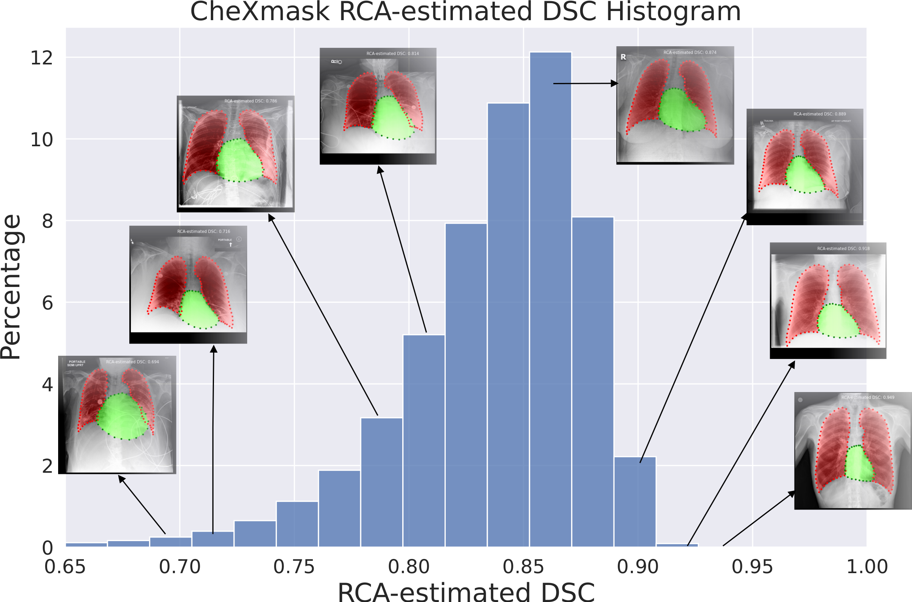

# CheXmask Database Code Repository

This repository accompanies the CheXmask Database, a large-scale dataset of anatomical segmentation masks for chest x-ray images. It includes segmentation masks for both original resolutions and preprocessed versions, detailed segmentation metrics, and associated pseudo-landmarks for the contours of the lungs and heart. 



## Dataset

CheXmask is an extensive and uniformly annotated set of chest radiographs, compiled from six public databases: CANDID-PTX, ChestX-ray8, Chexpert, MIMIC-CXR-JPG, Padchest, and VinDr-CXR. Our dataset comprises 676,803 anatomical segmentation masks, derived from images processed using the HybridGNet model to ensure consistent, high-quality segmentation.

Each dataset associated with this research is available as a CSV file. Each CSV file contains image IDs and corresponding pre-processed segmentation masks in Run-Length Encoding (RLE) format. Please note that the original chest X-ray images are not included in this dataset due to proprietary and privacy considerations. To access the dataset, please visit the following PhysioNet repo: [https://physionet.org/content/chexmask-cxr-segmentation-data](https://physionet.org/content/chexmask-cxr-segmentation-data).

## Code

The code in this repository is organized into different directories:

- `Annotations/`: Contains a placeholder file for the annotations csv files.
- `DataPreparation/`: Includes scripts for preparing the dataset, to be used with the HybridGNet if desired.
- `DataPostprocessing/`: Includes scripts to remove the pre-processing steps applied to the original chest X-ray images. Also includes scripts to convert the segmentation masks from RLE format to binary masks.
- `HybridGNet/`: Includes the code for training and using the HybridGNet model.
- `TechnicalValidation/`: Contains scripts for evaluating the segmentation quality using the Reverse Classification Accuracy (RCA) framework and the Physician studies.
- `Weights/`: Contains a placeholder file for the weights of the HybridGNet model. Should be downloaded from [here](https://drive.google.com/file/d/1yNCaLjKooiDQ2dDEfdK2K88s9_E8hpJS/view?usp=sharing)
- `Example.ipynb`: Shows how to read the masks with pandas, numpy and display them with matplotlib.

## Requirements

To run the code in this repository, the following dependencies are required:

- Python 3
- NumPy
- Pandas
- Matplotlib
- OpenCV

To use the HybridGNet model, the following additional dependencies are required:

- PyTorch
- PyTorchGeometric

Please refer to the source code of the HybridGNet for additional information: [https://github.com/ngaggion/HybridGNet](https://github.com/ngaggion/HybridGNet).

## Citations 

If you use this dataset or code in your research, please cite the following PhysioNet repository:

```
@misc{gaggion2023chexmaskPhysioNet,
  author = {Gaggion, N. and Mosquera, C. and Aineseder, M. and Mansilla, L. and Milone, D. and Ferrante, E.},
  title = {{CheXmask Database: a large-scale dataset of anatomical segmentation masks for chest x-ray images (version 0.1)}},
  year = {2023},
  howpublished = {PhysioNet},
  note = {\url{https://doi.org/10.13026/dx54-8351}}
}
```

If you use the HybridGNet model in your research, please cite the following paper:

```
@article{Gaggion_2022,
doi = {10.1109/tmi.2022.3224660},
url = {https://doi.org/10.1109%2Ftmi.2022.3224660},
year = 2022,
publisher = {Institute of Electrical and Electronics Engineers ({IEEE})},
author = {Nicolas Gaggion and Lucas Mansilla and Candelaria Mosquera and Diego H. Milone and Enzo Ferrante},
title = {Improving anatomical plausibility in medical image segmentation via hybrid graph neural networks: applications to chest x-ray analysis},
journal = {{IEEE} Transactions on Medical Imaging}
}
```